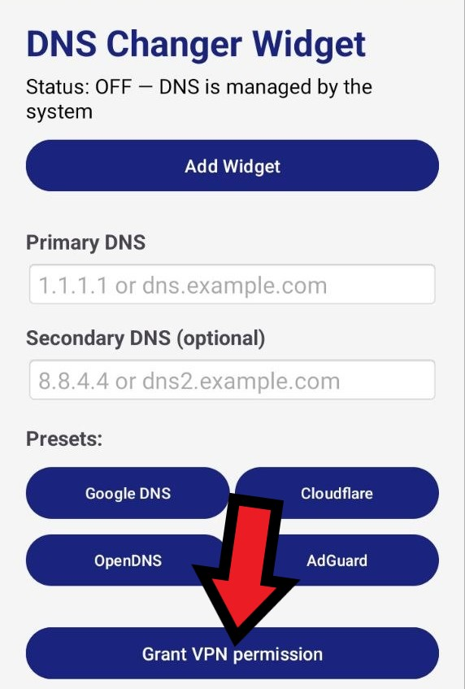
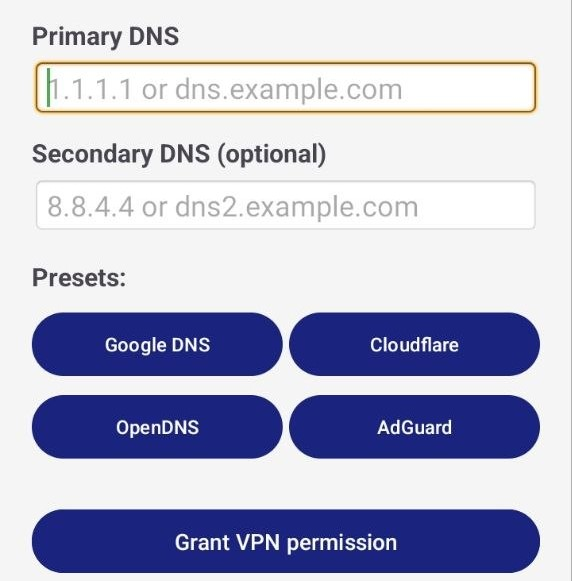
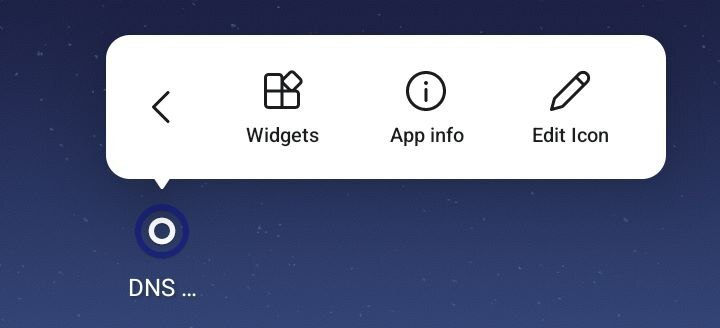
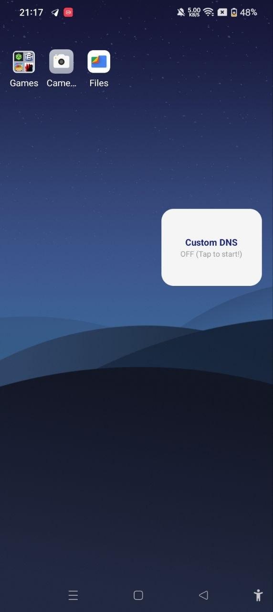

# DNS Changer Widget
A simple app for quickly switching between system and custom DNS servers directly from a home-screen widget.

## Setup

### 1. Install the app

### 2. Open the app and grant the required permissions

### 3. Choose your DNS server
Choose one of the available presets, or enter a DNS server URL/hostname or IP address manually.

### 4. Add the widget
Add the **DNS Changer Widget**.

If the `Add Widget` button doesn't work, press and hold the app icon, then tap `Widgets`.

### 5. Ready to use!
Use the widget to quickly turn the custom DNS on or off.

