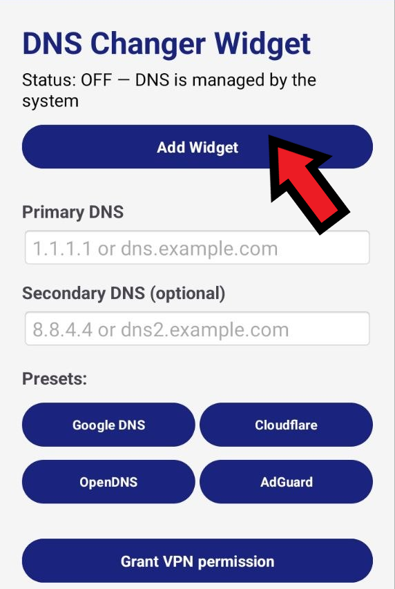

# DNS Changer Widget
A simple Android app for quickly switching between system and custom DNS servers directly from a home-screen widget.
## Setup

### 1. Install the app
[**Download the latest APK**](https://github.com/l6889l/dns-changer-widget/releases)

### 2. Open the app and grant the required permissions
<video src="https://github.com/l6889l/dns-changer-widget/blob/main/media/grant-permissions.mp4" controls></video>
### 3. Choose your DNS server
Choose one of the available presets, or enter a DNS server URL/hostname or IP address manually.

### 4. Add the widget
Add the **DNS Changer Widget** to your Android home screen.

If the **Add Widget** button inside the app does not work on your device, you can add the widget manually through Android's widget picker:

### 5. Ready to use!
Use the widget to quickly turn the custom DNS on or off.

